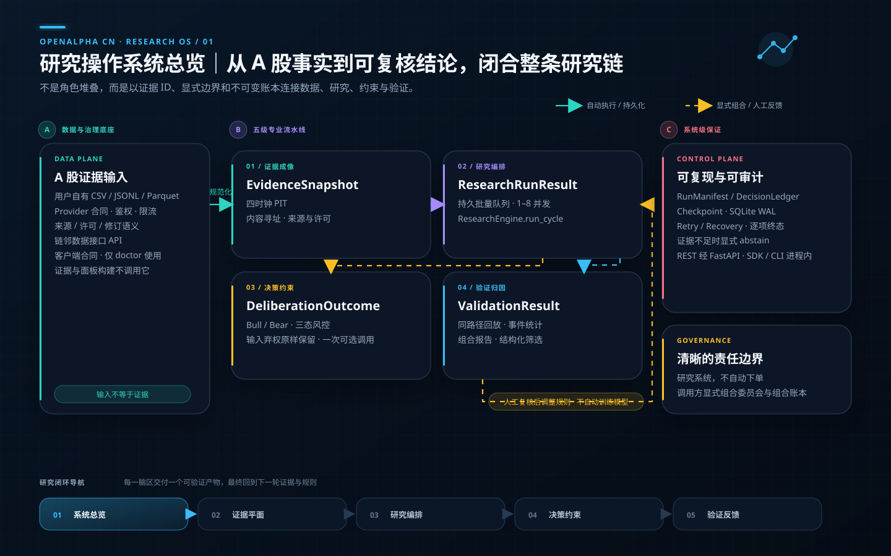
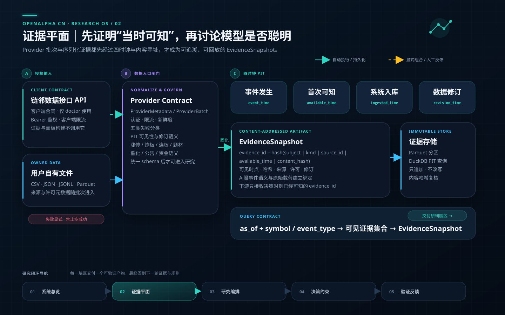
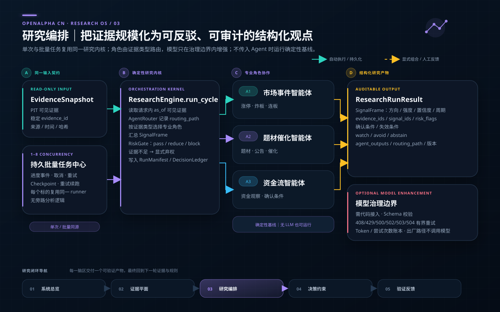
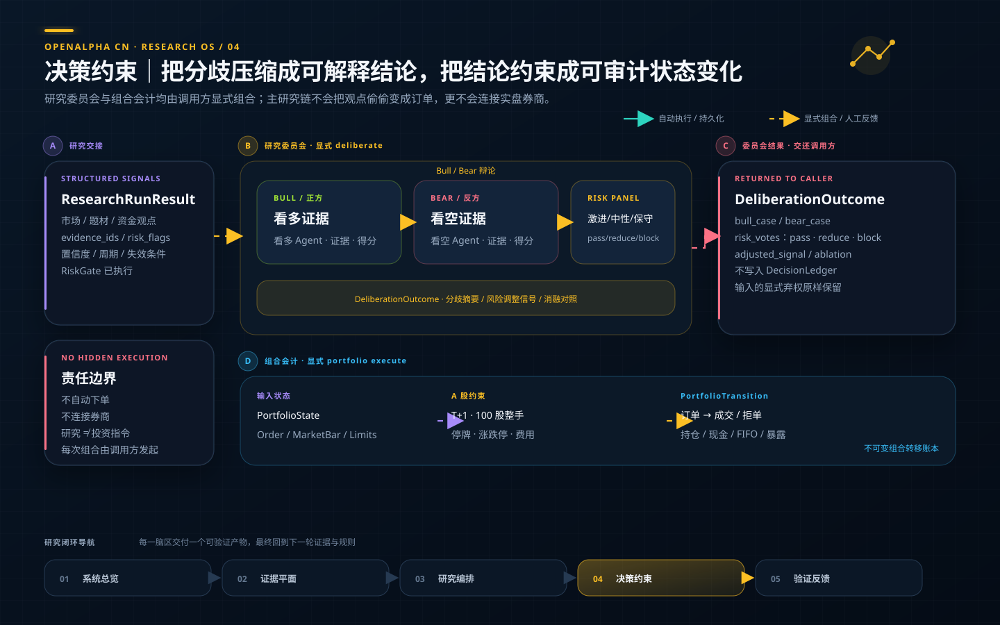
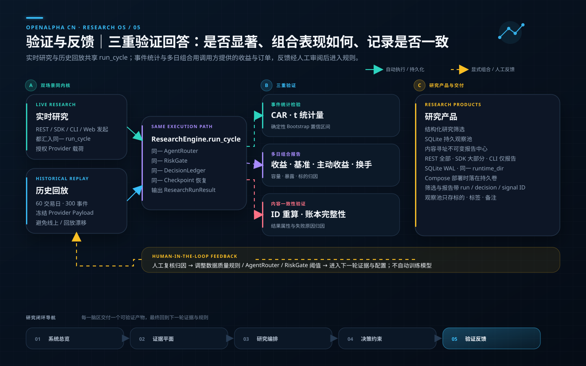
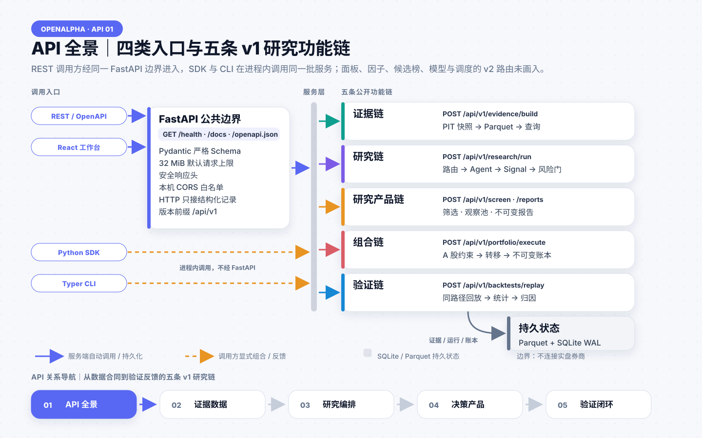
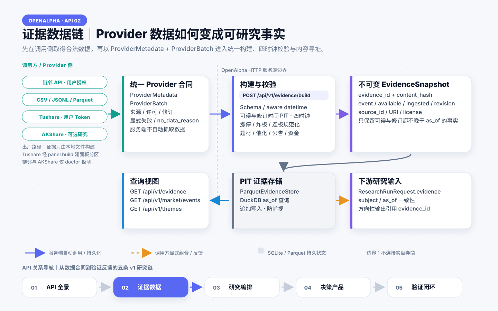
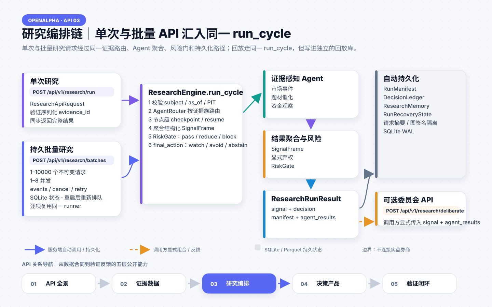
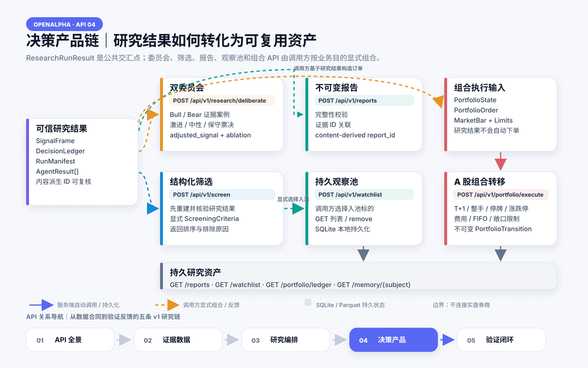
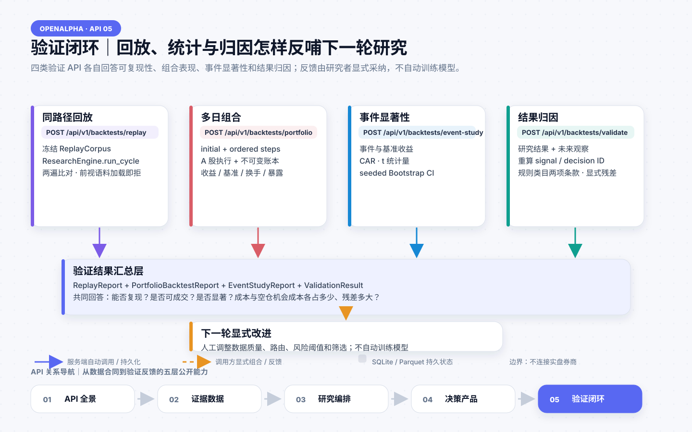

# OpenAlpha CN

面向中国 A 股的证据可追溯、时间点一致、多智能体可验证的开源投研系统。

[English](README.en.md) · [部署方案](docs/deployment/production.zh-CN.md) · [数据接口](docs/api/data-interface.zh-CN.md) · [三方源码对账](docs/audits/three-upstream-source-audit-20260724.md) · [为什么能形成优势](docs/why-openalpha-cn.zh-CN.md) · [功能台账](docs/release/openalpha-v1-feature-ledger.md)

## ✨ 核心特性

> **不只是堆叠更多 Agent 人设。** OpenAlpha CN 把 A 股研究中的数据、证据、智能体、风险、决策和回放连成一条可验证、可复现、可追溯的研究链路。

本轮已经把与高星项目对账后最关键的十类增强能力落到源码和测试中：

| 研究脑区 | 已落地能力 |
|---|---|
| 数据与证据 | 链邻合同型 Provider；Bearer 认证、客户端限流、PIT/修订语义与显式错误分类 |
| 规模化研判 | SQLite 持久批量队列；1–32 并发、逐项进度、协作式取消、重试与重启恢复 |
| 模型治理 | 模型能力注册、408/429/5xx 分类重试、Token/尝试次数/估算成本持久账本 |
| 辩论与风控 | 可消融 Bull/Bear 研究辩论；激进/中性/保守风险委员会 |
| 组合与验证 | 订单/成交/拒单不可变账本；多日收益、基准、主动收益、换手、容量与暴露归因 |
| 统计可信度 | CAR、t 统计量与确定性 Bootstrap 置信区间 |
| 研究产品 | 结构化筛选、持久观察池、内容寻址且关联证据的不可变报告中心 |

### 🇨🇳 A 股原生证据体系

- **本土市场语义**：原生规范化涨停、炸板、连板、题材、催化、公告和资金观察，不把海外市场字段生硬套用到 A 股。
- **四时钟防前视**：分别记录事件发生、首次可知、系统入库和数据修订时间，历史研究只能读取决策时刻已经可见的证据。
- **交易规则内建**：覆盖 T+1、100 股整手、停牌、涨跌停锁单和交易成本约束。
- **链邻统一数据入口**：已实现 `chainlin-data/v1` 合同型 Provider；可作为分散接口的统一替代入口，真实时效与精度由用户所配置的链邻服务、授权和上游数据决定。

### 🤖 可验证的多智能体决策

- **证据驱动协作**：市场事件、题材催化和资金流智能体经证据感知路由协作，每项输出都引用 `evidence_id`。
- **结构化决策链**：用 `SignalFrame`、`DecisionLedger`、风险门和显式弃权替代无法审计的自由文本结论。
- **双委员会研判**：Bull/Bear 研究辩论与激进/中性/保守风险委员会均可独立启停，既保留观点碰撞，也能做消融对照。
- **批量研究编排**：持久任务队列支持 1–32 并发、逐项进度、协作式取消、失败重试和进程重启恢复。
- **模型可插拔**：无 LLM 时可确定性运行；接入模型后强制结构化输出、Schema 校验和有界重试。
- **模型治理与核算**：按模型能力选择兼容端点，对 408/429/5xx 分类重试，并持久记录 Token、尝试次数与按用户单价估算的成本。
- **安全 BYOK**：内置 OpenAI-compatible Provider，支持 OpenAI、DeepSeek、Qwen、Ollama 或用户自建兼容端点；密钥只从环境变量读取。

### 🔁 同路径回放与归因

- **同一研究内核**：实时研究、历史回放与验证共用 `run_cycle`，避免线上逻辑和回测逻辑各走一套。
- **确定性回放**：内置 60 个交易日、300 个代表性事件的冻结语料，验证结果一致性和已知前视违规。
- **结果可解释**：统一计入 A 股交易约束与成本，并提供规则、因子和智能体归因。
- **不可变组合账本**：订单、成交、拒单和持仓转移全部追加记录；同时维护现金、持仓批次、估值、费用和已实现盈亏。
- **多日组合报告**：统一输出收益、基准、主动收益、换手、最大订单容量和标的暴露归因。
- **事件统计检验**：提供 CAR、t 统计量和可复现的 Bootstrap 置信区间，不用单条收益曲线代替显著性。

### 🔌 开放的数据与使用接口

- **合规数据接入**：链邻合同型 Provider 是面向 A 股数据的统一入口；用户自有 CSV、JSON、JSONL、Parquet 以及 BYOT/可选研究 Adapter 作为补充。
- **失败必须显式**：Provider 统一声明凭据、来源、许可、时效、限流与失败语义，禁止把数据错误伪装成“空结果成功”。
- **多入口一致**：同一能力通过 REST API、Python SDK、CLI 和响应式 React 研究工作台开放。
- **批量任务中心**：任务、并发上限、逐项进度、取消、重试和重启恢复均持久化。
- **研究产品接口**：提供结构化筛选、观察池和内容寻址报告中心。

### 🛡️ 可复现的工程底座

- **完整复现清单**：`EvidenceSnapshot` 内容寻址；`RunManifest` 记录代码、配置、Provider、模型、Prompt、随机种子和环境版本。
- **可恢复运行**：SQLite WAL 保存运行、决策、持久记忆和节点 Checkpoint；中断后从下一节点恢复，请求或图结构变化会拒绝误用旧状态。
- **完成度可审计**：功能台账中的每项能力都具有唯一 ID、源码证据、测试证据和终态去向，`UNREVIEWED=0`、`UNKNOWN=0`。

## 🧠 五图读懂 OpenAlpha CN

OpenAlpha CN 不是把智能体角色堆在一起，而是把 **A 股事实、时间点证据、结构化研究、风险裁决、组合会计与统计验证** 组织成一套可复现的研究操作系统。下面五张图按实际使用顺序展示系统如何工作。

**链邻数据接口 API** 已具备合同优先的 BYOK Provider，统一约束 Bearer 认证、四时钟 PIT、数据修订、客户端限流和失败分类。用户配置真实服务地址、Token 与数据授权后即可启用；仓库不内置或转售链邻商业数据。

五张图共用同一条“研究闭环导航”。图中 **实线表示系统自动执行或持久化**，**虚线表示调用方显式组合或人工反馈**；每一图都交付一个可以被下一图消费、也可以独立复核的结构化产物：

`市场事实 → EvidenceSnapshot → ResearchRunResult → DeliberationOutcome / PortfolioTransition → ValidationResult → 人工审阅后反馈到下一轮证据与规则`

### 01｜系统总览：一条由证据 ID 与不可变账本闭合的研究链

<p align="center">
  
</p>

### 02｜证据平面：先证明“当时可知”，再讨论模型是否聪明

<p align="center">
  
</p>

### 03｜研究编排：让专业角色围绕同一证据规模化协作

<p align="center">
  
</p>

### 04｜决策约束：把观点分歧压缩成可解释、可审计的状态变化

<p align="center">
  
</p>

### 05｜验证反馈：回答是否有效、为何有效、下一轮应该改什么

<p align="center">
  
</p>

## 不想本地部署

可直接下载 **链邻涨停复盘策略软件 1.0.9**：

[下载 Windows x64 安装版](https://github.com/ss8875/openalpha-cn/releases/download/chainlin-desktop-v1.0.9/Lianlin-LimitUp-Review-Setup-1.0.9-x64.exe)

- 文件名：`Lianlin-LimitUp-Review-Setup-1.0.9-x64.exe`
- 大小：`144,902,921 bytes`（约 `138.19 MiB`）
- SHA-256：`0DDD3AF69C671C3AF0F7AEC90D57B77363705E38E871B49D640C7A2D0D05838B`
- 当前安装包未做数字签名，Windows 可能显示 SmartScreen 提示
- 链邻桌面软件是单独发行物，不自动适用本仓库 MIT 许可证

```powershell
Get-FileHash .\Lianlin-LimitUp-Review-Setup-1.0.9-x64.exe -Algorithm SHA256
```

<p align="center">
  
</p>

<p align="center">扫码添加微信，咨询安装、部署、数据接入和产品使用问题。</p>

## 安装说明

### 安装链邻涨停复盘策略软件

适用于不希望配置 Python、Node、数据库和 OpenAlpha CN 运行环境的 64 位 Windows 用户。

#### 第 1 步：下载安装包

点击上方“下载 Windows x64 安装版”，或进入 [链邻桌面软件 Release 页面](https://github.com/ss8875/openalpha-cn/releases/tag/chainlin-desktop-v1.0.9) 下载：

`Lianlin-LimitUp-Review-Setup-1.0.9-x64.exe`

只使用 `github.com/ss8875/openalpha-cn` 发布的文件；不要运行从网盘、聊天群或不明网站转发的同名安装包。

#### 第 2 步：校验文件

打开安装包所在目录，在 PowerShell 中执行：

```powershell
Get-FileHash .\Lianlin-LimitUp-Review-Setup-1.0.9-x64.exe -Algorithm SHA256
```

确认以下两项完全一致：

- 文件大小：`144,902,921 bytes`
- SHA-256：`0DDD3AF69C671C3AF0F7AEC90D57B77363705E38E871B49D640C7A2D0D05838B`

如果大小或哈希不一致，请删除该文件并从 GitHub Release 重新下载，不要继续安装。

#### 第 3 步：运行安装程序

1. 双击 `Lianlin-LimitUp-Review-Setup-1.0.9-x64.exe`。
2. 当前安装包未做数字签名，Windows 可能显示 SmartScreen 提示。
3. 只有在下载地址、文件大小和 SHA-256 均已核验正确后，才点击“更多信息”并选择“仍要运行”。
4. 如果出现 Windows 用户账户控制提示，请再次确认文件名和来源，然后允许安装程序运行。

#### 第 4 步：完成安装

按照安装向导选择安装位置和快捷方式选项，确认后等待安装完成。安装结束后，可从安装完成页、Windows 开始菜单或桌面快捷方式启动软件；具体入口以安装向导实际创建的项目为准。

#### 第 5 步：遇到问题

- 无法下载：进入 [Release 页面](https://github.com/ss8875/openalpha-cn/releases/tag/chainlin-desktop-v1.0.9) 重新下载。
- 哈希不一致：不要运行，删除后重新下载。
- SmartScreen 拦截：先完成哈希校验，再按上面的安全步骤处理。
- 安装或使用仍有问题：扫描上方微信二维码，咨询安装、数据接入和产品使用。

### 安装 OpenAlpha CN

适用于希望连接自己的数据源、扩展 Provider 或智能体、使用 API/SDK/CLI/Web 的开发者和研究者。

#### 方式一：Docker Compose

准备 Git、Docker Desktop 或 Docker Engine，并确认 `docker compose version` 可以正常执行。

```powershell
git clone https://github.com/ss8875/openalpha-cn.git
Set-Location openalpha-cn
docker compose -f deploy/compose.yml up -d --build
docker compose -f deploy/compose.yml ps
Start-Process http://127.0.0.1:8000
```

浏览器打开 `http://127.0.0.1:8000`。接口文档位于 `http://127.0.0.1:8000/docs`，健康检查地址为 `http://127.0.0.1:8000/health`。

停止服务但保留研究数据：

```powershell
docker compose -f deploy/compose.yml down
```

运行数据保存在独立 Docker 卷中。不要执行 `down --volumes`，除非明确要删除本地研究证据、运行记录和决策账本。

#### 方式二：Python 源码环境

准备 Python 3.11 或 3.12，并安装 `uv`：

```powershell
git clone https://github.com/ss8875/openalpha-cn.git
Set-Location openalpha-cn
Copy-Item .env.example .env
uv sync --locked --all-extras --dev
uv run openalpha doctor
uv run openalpha serve
```

服务默认只监听本机 `127.0.0.1:8000`。数据源 Token 和模型密钥由用户写入本地 `.env`，不要提交到 Git。完整配置、备份、恢复和升级方法见[详细部署方案](docs/deployment/production.zh-CN.md)。

## 数据优势如何体现

OpenAlpha CN 不把“多接几个行情 API”当作数据优势。优势落在可验证的数据合同：

```text
合法来源 / 用户自有数据
→ event_time / available_time / ingested_time / revision_time
→ 内容寻址 Evidence Snapshot
→ 仅使用决策时刻可见信息
→ 智能体、风险与决策完整引用 evidence_id
→ 同路径回放、结果验证与归因
```

默认支持用户自有 CSV、JSON、JSONL、Parquet，用户自带 Token 的 Tushare Pro，以及可选、受限的 AKShare Adapter。项目提供数据接入接口，但不提供商业数据转售代理，也不把受限原始数据放进 GitHub。

详见[数据接口与合规边界](docs/api/data-interface.zh-CN.md)。

## 核心独特优势

OpenAlpha CN 整合 TradingAgents 和 AI Hedge Fund 的优势，接入 A 股数据源，更适合 A 股涨停量化分析。OpenAlpha CN 的竞争重点不是复制更多“投资大师人格”，而是：

1. A 股原生事件语义和交易约束；
2. 证据首次可知时间与防未来函数；
3. 每个结论、决策、回放和归因都能追溯；
4. 无 LLM 也能确定性运行，接入 LLM 时强制结构化输出和有界重试；
5. 同一核心路径贯通 API、SDK、CLI、Web 与回放；
6. 功能状态必须有源码和测试证据，愿景、Stub、按钮不算完成。

源码审计基线、差异化结论和后续边界见[竞争优势说明](docs/why-openalpha-cn.zh-CN.md)。

## 🧭 五张 API 数据与功能关系图

OpenAlpha CN 的公开 API 不是一组彼此孤立的地址，而是围绕同一份可验证数据逐层展开：
调用方先把合法来源的数据整理为统一 Provider 合同，系统再生成时间点证据；单次研究和批量
研究复用同一 `ResearchEngine.run_cycle`；研究结果由调用方显式送入委员会、筛选、报告、
观察池或组合核算；最后由回放、事件统计、组合报告和结果归因完成验证闭环。

图中**实线表示服务端自动调用或持久化**，**虚线表示调用方显式组合或人工反馈**。这个区别
非常重要：研究结果不会自动变成组合订单，验证结果也不会自动训练模型。

### API 关系图 01｜四类入口共享五条功能链

REST、Python SDK、Typer CLI 和 React 工作台最终进入同一 FastAPI 公共边界。请求经过
Pydantic Schema、请求大小限制与安全响应头后，分别流向证据、研究、研究产品、组合和验证
五条功能链；运行数据统一沉淀到 Parquet 与 SQLite WAL，而不是由各入口维护不同状态。

<p align="center">
  
</p>

### API 关系图 02｜Provider 数据如何变成可研究证据

链邻 API、用户文件、Tushare 和可选 AKShare Adapter 位于调用方或 Provider 侧。
`POST /api/v1/evidence/build` 只接收结构化 `ProviderMetadata + ProviderBatch`，不会在
服务端自动抓取数据。记录通过 Schema、四时钟 PIT 和 A 股事件规范化后生成内容寻址的
`EvidenceSnapshot`，写入 Parquet，再由证据、市场事件和题材查询接口按 `as_of` 提供给研究。

<p align="center">
  
</p>

### API 关系图 03｜单次与批量研究如何汇入同一内核

`POST /api/v1/research/run` 直接运行一次研究；批量 API 则把最多 1000 个不可变请求放入
持久队列，以 1–32 的受控并发逐项调用同一 `run_cycle`。证据感知路由选择市场、题材和
资金 Agent，节点级 Checkpoint 支持恢复，聚合后的 `SignalFrame` 经过风险门生成
`ResearchRunResult`，同时持久化运行清单、决策账本、研究记忆和恢复状态。

<p align="center">
  
</p>

### API 关系图 04｜研究结论如何转化为产品与组合资产

`ResearchRunResult` 是下游功能的可信交汇点。调用方可把 `signal + agent_results` 送入
Bull/Bear 与三视角风险委员会，把完整研究结果送入筛选或不可变报告，也可以明确选择标的
加入观察池。组合 API 还要求调用方单独提交 `PortfolioState`、`PortfolioOrder`、
`MarketBar` 和限制条件，通过 T+1、整手、停牌、涨跌停、费用与敞口检查后，才产生
不可变 `PortfolioTransition`；它不会根据研究结论自动下单，也不连接实盘券商。

<p align="center">
  
</p>

### API 关系图 05｜回放、统计和归因如何形成验证闭环

冻结语料回放再次调用同一 `run_cycle`，用于检查确定性和前视问题；多日组合 API 计算
收益、基准、换手、容量和暴露；事件研究 API 给出 CAR、t 统计量和确定性 Bootstrap
置信区间；结果验证 API 则先复核内容派生 ID，再把未来观察归因到规则、因子和 Agent。
这些结果由研究者审阅后用于调整数据质量、路由、风险阈值和筛选条件，不会自动修改模型。

<p align="center">
  
</p>

## 公开 API

| 能力 | 入口 |
|---|---|
| 健康检查 | `GET /health` |
| 构建/查询证据 | `POST /api/v1/evidence/build` / `GET /api/v1/evidence` |
| 市场事件/题材 | `GET /api/v1/market/events` / `GET /api/v1/themes` |
| 多智能体研究 | `POST /api/v1/research/run` |
| 批量研究与进度 | `POST /api/v1/research/batches` / `GET /api/v1/research/batches/{batch_id}/events` |
| 多空辩论与风险委员会 | `POST /api/v1/research/deliberate` |
| 筛选、观察池、报告 | `POST /api/v1/screen` / `GET /api/v1/watchlist` / `GET /api/v1/reports` |
| 持久研究记忆 / 运行恢复 | `GET /api/v1/memory/{subject}` / `GET /api/v1/runs/{run_id}/recovery` |
| 冻结语料回放 | `POST /api/v1/backtests/replay` |
| A 股组合账本 | `POST /api/v1/portfolio/execute` |
| 多日组合 / 事件研究 | `POST /api/v1/backtests/portfolio` / `POST /api/v1/backtests/event-study` |
| 结果与归因 | `POST /api/v1/backtests/validate` |
| OpenAPI | `GET /docs` / `GET /openapi.json` |

默认只绑定 `127.0.0.1`。如果要跨机器开放，必须在前置网关配置 HTTPS、认证、访问控制和限流。

## 验证

```powershell
uv sync --locked --all-extras --dev
uv run pytest --cov=openalpha_cn --cov-report=term-missing --cov-fail-under=80
uv run ruff check .
uv run ruff format --check .
uv run mypy src scripts
uv build
uv run python scripts/build_feature_coverage.py --check
uv run python scripts/verify_publication.py
```

```powershell
Set-Location web
pnpm install --frozen-lockfile
pnpm audit --audit-level high --registry https://registry.npmjs.org
pnpm lint
pnpm test
pnpm build
pnpm test:e2e
```

容器持久化恢复实测：

```powershell
uv run python scripts/verify_compose_recovery.py
```

## 许可证

OpenAlpha CN 源码采用 [MIT License](LICENSE)。第三方数据、模型、服务、品牌素材与链邻桌面安装程序保留各自授权边界，见 [THIRD_PARTY_NOTICES.md](THIRD_PARTY_NOTICES.md)。
